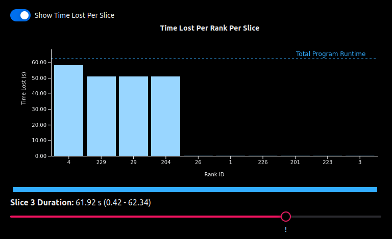
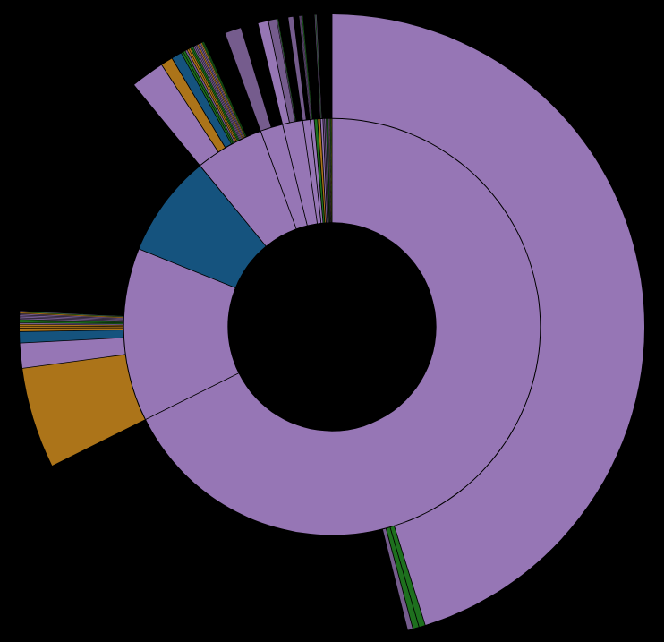

---

The **WorkVisualizer** is an interactive, high-level performance analysis tool from NexGen Analytics designed to facilitate profiling of scientific applications.

 

 

 

## Your Application's Execution, _Visualized_

Is your parallel program **losing time**?

Are some MPI ranks **waiting** for others?

Are you **wasting compute resources** with inefficient code?

Are you **wasting developer time** searching for the problem?

<figure>
  
  <figcaption>Analysis Viewer: Easily determine where your application is losing time.</figcaption>
</figure>

<figure>
  
  <figcaption>Proportion Analyzer: See where your application spends its time.</figcaption>
</figure>

<figure>
  
  <figcaption>Events Plot: View an interactive, trace-like visualization of your application's execution.</figcaption>
</figure>

> [!NOTE]
> All sample data comes from [CabanaMD](https://github.com/ECP-copa/CabanaMD).

<!-- HOW TO EMBED A YOUTUBE VIDEO -->

<!-- 

  <iframe width="560" height="315" src="https://www.youtube.com/embed/zqNTltOGh5c"
          title="Test Video" frameborder="0"
          allow="accelerometer; autoplay; clipboard-write; encrypted-media; gyroscope; picture-in-picture"
          allowfullscreen>
  </iframe>

 -->
